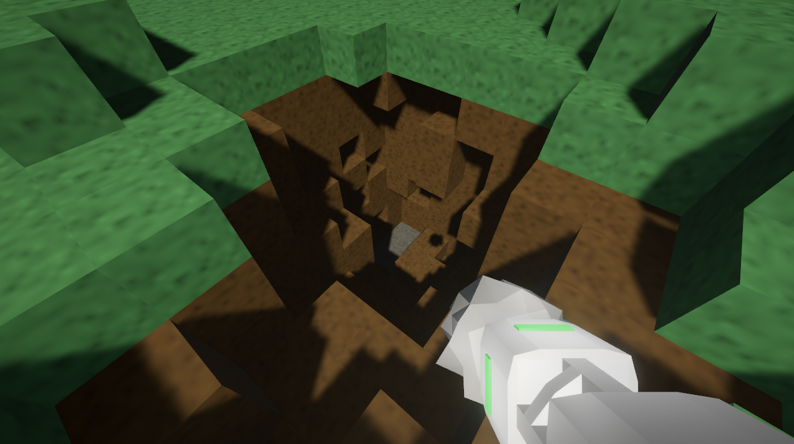
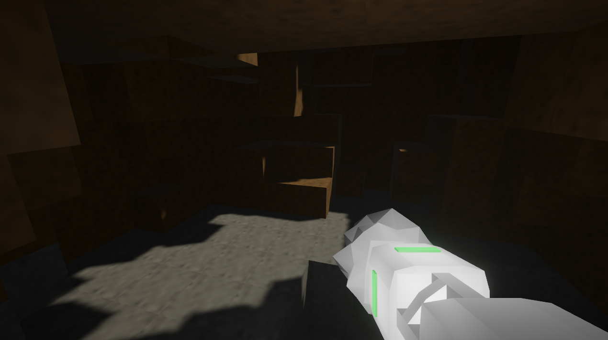

# Metal Miner

It's a game where you dig! Underground, there are minerals which
you're supposed to send up to orbit. Made for Ludum Dare 48 in 48
hours.

## Controls

- WASD / arrow keys to move.
- Move mouse to look around.
- Left-click to dig.
- Right-click to submit your minerals to the mineral storage hut.
- Escape to open a menu for options and quitting the game.

## License

This game is distributed under the [GNU GPLv3 license](LICENSE.md).

## Screenshots

